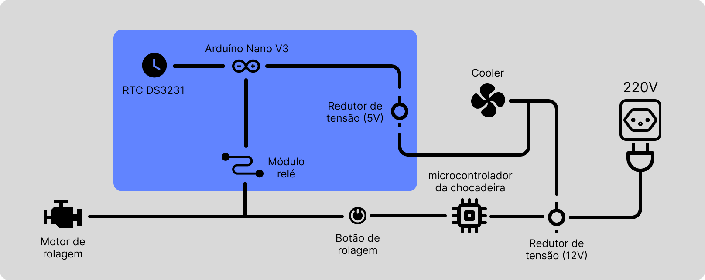
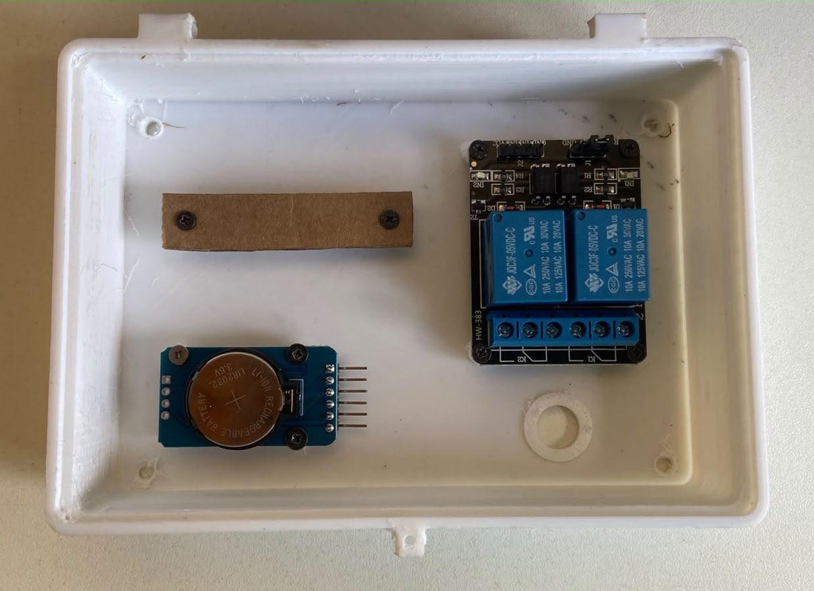
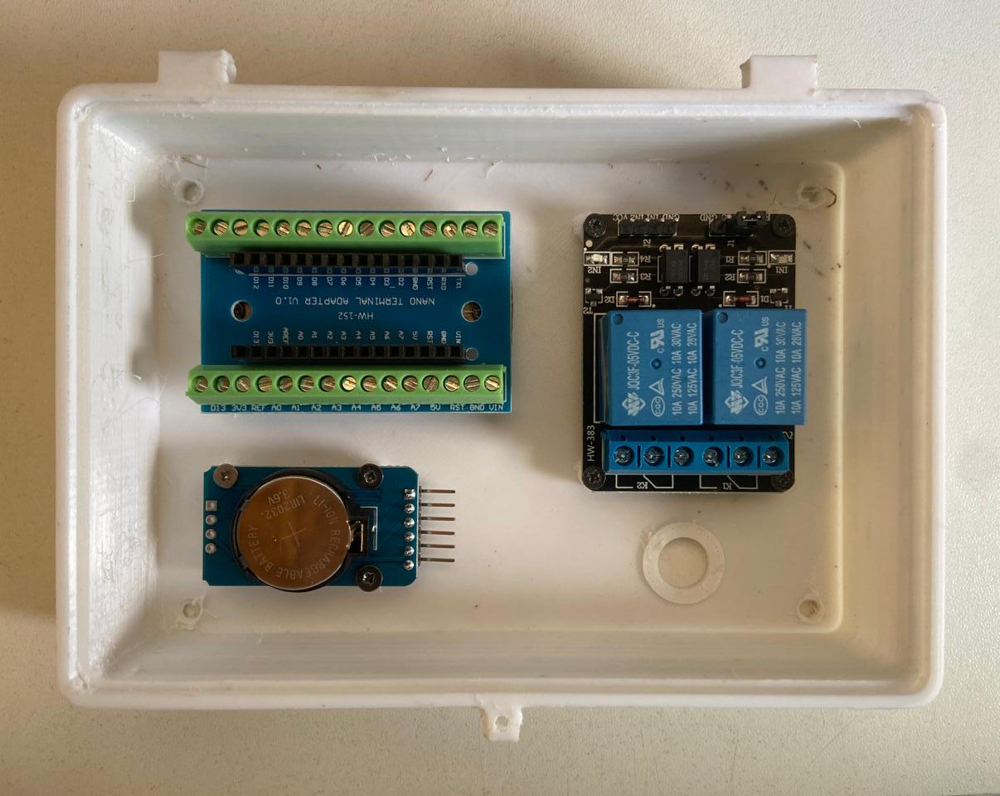
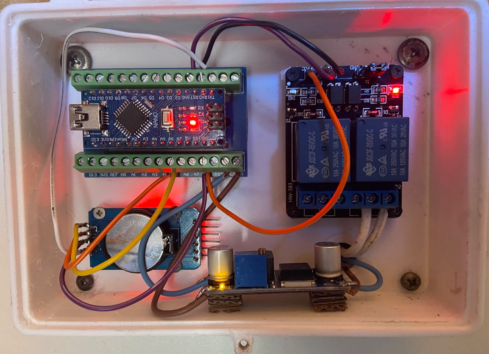

# Especificações Técnicas do Projeto

Apresenta as disposições técnicas do projeto de elaboração de uma automação para a rolagem de ovos da chocadeira da marca InChoc.

## Componentes utilizados

* Arduíno Nano V3;
* Módulo RTC DS3231;
* Módulo Relé (2 canais - 5V);
* Módulo Regulador de Tensão Step Down LM2596;
* Placa Borne (para Arduíno Nano);

## Descrição dos componentes

#### 1. Arduíno Nano V3

Utilizou-se a tecnologia arduíno para gestão dos processos envolvidos na automação. Foi optado pela placa do tipo Nano V3 para que o projeto, em sua versão final, seja o mais compacto e profissional possivel. O arduíno serve como o controlador chave da automação. Ele fará a gestão tanto dos outros componentes como dos processos realizados por eles.

#### 2. Módulo RTC DS3231

A partir do objetivo principal do projeto, o acionamento do motor de rolagem da chocadeira em certos horários do dia, viu-se a necessidade de utilizar um módulo de relógio para obtenção precisa do tempo.

O módulo RTC DS3231 foi escolhido por sua tecnologia atualizada e de baixa complexidade. Utilizamos nesta automação somente as suas portas de alimentação (VCC e GND) e as suas portas básicas de entrada (SCL e SDA).

* VCC: conecta na porta 5V do arduíno.
* GND: conecta na porta GND do arduíno.
* SCL: conecta na quarta porta analógica (A4) do arduíno.
* SDA: conecta na quinta porta analógica (A5) do arduíno.

Obs.: É imprescindível que seja utilizada uma pilha do tipo LIR2032 no RTC. A não utilização dessa pilha pode acarretar problemas no seu componente. Caso fique com dúvidas em relação a essa observação, orienta-se que faça uma pesquisa mais aprofundada sobre o assunto.

#### 3. Módulo Relé

O projeto depende do acionamento, em certos momentos, de um motor de rolagem que atua com a tensão vinda da rede elétrica. Então devemos isolar os componentes que trabalham em baixa tensão, para que não sejam danificados pelo circuito de força. 

Para essa função utilizamos um módulo relé. Veja que foi utilizado um módulo de dois canais para o projeto, porém não haveria necessidade para tanto. Como utilizamos apenas um circuito de força (a do motor), precisaríamos apenas de um canal. O segundo seria utilizado para um possível uso (como alguns dos componente utilizados no projeto foram comprados antes da análise final do circuito elétrico da chocadeira, optou-se por usar um módulo relé possivelmente redundante).

Utilizamos as portas de alimentação do módulo (VCC e GND) e o pino controlador do primeiro canal (IN1):

* VCC: conecta na porta 5V do arduíno.
* GND: conecta na porta GND do arduíno.
* IN1: conecta na segunda porta digital (D2) do arduíno.

#### 4. Módulo Regulador de Tensão

Para que o arduíno trabalhe da forma correta e não queime, precisamos reduzir a tensão ofertada pela chocadeira (12V). Então, optamos por utilizar o módulo Step Down LM2596.

Como esse processo funciona? A energia na tensão inicial (12V) entra nos pinos IN+ e IN-, o primeiro recebe o polo positivo e o segundo recebe o polo negativo da rede elétrica, respectivamente. Na saída com a tensão reduzida temos as portas OUT+ e OUT-.

* IN+: recebe polo positivo da rede 12V.
* IN-: recebe o polo negativo da rede 12V.
* OUT+: conecta na porta de alimentação (VIN) do arduíno.
* OUT-: conecta na porta de aterramento (GND) do arduíno.

#### 5. Placa Borne

Compramos uma placa arduíno com seus pinos já soldados. Para que o projeto fique mais profissional e seguro, utilizamos um adaptador para que possamos conectar a afiação do projeto ao arduíno. Essa adaptação é realizada pela placa borne.

## Diagrama do Circuito

O circuito elétrico e de controle da chocadeira em seu início mostrava-se bastante simples. Veja sua disposição simplificada a seguir:

    

Obs: o "Redutor de tensão (12V)" faz a redução apenas da tensão da linha que chega no "Cooler" e no "Redutor de tensão (5V)"; a linha que passa pelo "Microcontrolador da chocadeira", pelo "Botão de rolagem" e chega no "Motor de rolagem" se mantêm na tensão de 220V.

## Adaptações do Projeto

Algumas adaptações foram realizadas na organização do circuito no protetor construido por impressão 3D. Os pinos de fixação da placa borne no protetor não bateram com as perfurações da placa. Então mostrou-se preciso realizar a seguinte adaptação:

    

A imagem anterior apresenta uma "guabiarra" que foi utilizada para fixar a placa. Ao invés de parafusar a placa diretamente nos pinos do protetor de circuito, parafusamos uma superfície rígida (um pedaço de papelão) nos pinos e depois colamos a placa borne nessa superfície. Veja o resultado a seguir:

    

Além disso, não havia sido prevista, até a modelagem do protetor de circuito, a utilização do redutor de tensão. Então não houve lugar definido para fixação desse redutor, sendo necessário fazer sua colagem utilizando um suporte improvisado (feito com papelão). Veja o resultado a seguir:

    

Essa já é disposição final do circuito de controle.